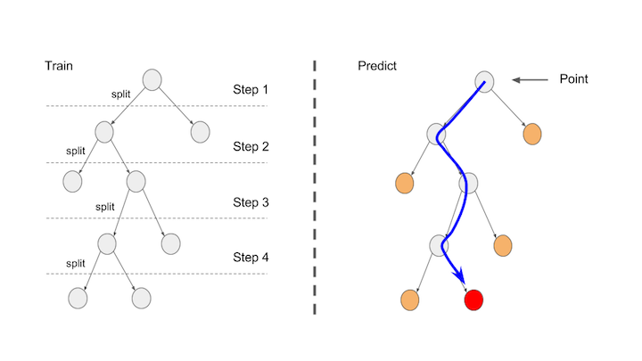

Introducing Bisecting Kmeans in MLlib

The latest released Apache Spark 1.6 introduced a distributed bisecting k-means clustering algorithm ([SPARK-6517](https://issues.apache.org/jira/browse/SPARK-6517)) which is a kind of hierarchical clustering algorithm.
Hierarchical clustering algorithm is one of the most widely used clustering algorithms.
It outputs a hierarchy, a structure that is more informative than the unstructured set of clusters returned by flat clustering like k-means clustering.
In this post, we highlight the bisecting k-means clustering in MLlib.

## Bisecting k-means

In general, there are two strategies for hierarchical clustering:

- Agglomerative: This is a "bottom up" approach: each observation starts in its own cluster, and pairs of clusters are merged as one moves up the hierarchy.
- Divisive: This is a "top down" approach: all observations start in one cluster, and splits are performed recursively as one moves down the hierarchy.

Bisecting k-means is a divisive hierarchical clustering.
Actually, a top-down clustering method and is less commonly used.
However, it is difficult to implement a agglomerative approach on a shared-nothing cluster, such as Apache Spark.
So, we implement it as a divisive approach.

The algorithm starts from a single cluster that contains all points.
Iteratively it finds divisible clusters on the bottom level and bisects each of them using k-means, until there are `k` leaf clusters in total or no leaf clusters are divisible.
The bisecting steps of clusters on the same level are grouped together to increase parallelism.
If bisecting all divisible clusters on the bottom level would result more than `k` leaf clusters, larger clusters get higher priority.

When assigning a point to a cluster, it starts with comparing the point with the children cluster centers of the root cluster node.
And again, it is compared with the children cluster centers of the closest child of the root.
It is going to continue until it reaches any leaf cluster node.
Finally, a point will be assigned to the closest leaf cluster node.



# A Code Example

The bisecting k-means in MLlib currently has 4 parameters:

* `k`: the desired number of leaf clusters. The actual number could be smaller if there are no divisible leaf clusters.
* `maxIterations`: the max number of k-means iterations to split clusters.
* `minDivisibleClusterSize`: the minimum number of points (if >= 1.0) or the minimum proportion of points (if < 1.0) of a divisible cluster.
* `seed`: a random seed.

In general, hierarchical clustering does not require us to prespecify the number of clusters and most hierarchical algorithms that have been used in IR are deterministic.
Since it's hard to hold a hierarchy of massive data points, we have a parameter to set the end condition of the clustering.
And as a result of the clustering, a dendrogram should have all points as leaf nodes.
Because of the same reason, we provide `minDivisibleClusterSize` for a parameter to define a condition to stop splitting.

```
import org.apache.spark.mllib.clustering.BisectingKMeans

val trainData: RDD[Vector] = ...
val model = new BisectingKMeans()
  .setK(k)
  .setMaxIterations(maxIterations)
  .setMinDivisibleClusterSize(minDivisibleClusterSize)
  .setSeed(seed)

val point: Vector = ...
model.predict(point)

val points: RDD[Vector] = ...
model.predict(points)
```

## What's next?

We currently have only basic methods like train/predict methods.
It would be great to add method(s) to extract a cluster tree as a dendrogram([SPARK-11664](https://issues.apache.org/jira/browse/SPARK-11664)).
Because we might want to visualize a dendrogram to confirm the result.
We should also include model import/export for this algorithm([SPARK-8459](https://issues.apache.org/jira/browse/SPARK-8459)).
Finally, we currently support only Euclidean distance to calculate a distance between a cluster center and each point.
Some NLP guys requested us to add other distance metrics, such as Cosine distance, Tanimoto distance and so on.

## Acknowledgement

The development of bisecting k-means has been a collaboration between many Spark contributors.
Xiangrui Meng and Yu Ishikawa made the recent implementation, and Jeremy Freeman, RJ Nowling and others contributed to this work.
